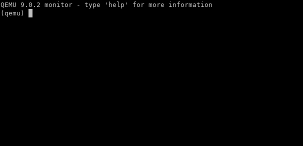

# Windows-KVM

Run Windows 10 and older versions in optimized environment inside plain QEmu with KVM. TPM is currently not available. You need qemu-system-x86 package with KVM support. Required QEmu version is 9.0.2.

You need these packages : *qemu-system-x86_64 (with KVM support), qemu-utils, qemu-system-gui, wget* and other dependencies that they need.

**Available features :**

1. UEFI with Secure Boot enabled

2. VirtIO and Hyper-V optimizations

4. Manual memory (RAM) ballooning

5. Paravirtualized Internet

6. Universal host audio backend support from guest to host.

  

**Currently not available :**

1. Shared Clipboard

2. Shared folder

3. TPM

  

## Start :

**Installation Preparation :**

1. Verify your system supports KVM by installing `cpu-checker`package and running `sudo kvm-ok`. If KVM is enabled, you will get this message : 
```
INFO: /dev/kvm exists
KVM acceleration can be used
```

2. run in Terminal : `cd ~/Documents/ && git clone https://github.com/rafsanislam09/Windows-KVM.git --depth 1 && cd Windows-KVM`. Ensure you have installed git.

3. Download Windows ISO from [https://www.microsoft.com/software-download/](https://www.microsoft.com/software-download/), move it to the 'Windows-KVM' directory and rename it as 'Windows.iso'.

4. Install required packages `qemu-system-x86`  `qemu-utils`  `qemu-system-gui`  `wget` and other dependencies required for them.

5. customize `#Editable` section in `Configuration.conf`

6. run in terminal : `chmod +x ./run-Windows.sh && ./run-Windows.sh`.

  

**Installation :**

1. Follow screen instructions.

2. When you will be in 'Select Disk' section, click on 'Load drivers'. Then browse to (CD/DVD) 'D:\virtio-win-<version_number>\amd64\' and select 'w10' folder. Click OK. Then you will get the required driver to install Windows on a specific disk. Click Next and select the virtual disk.

3. Finish installation process.

  

**Installation of VirtIO drivers :**

1. Go to `virtio-win-<version-number>` disk marked as a CDROM in File Explorer.

2. Run virtio-win-guest-tools.exe as an administrator.

3. Follow on screen instructions to install. Select all the drivers in setup window, when you will be asked. By default all drivers are marked to be installed.

4. Reboot Windows guest.

  

**Ballon RAM :**

1. Go to QEmu monitor by going to -> View (On the menu bar of QEmu Viewer) > compatmonitor()

2. You will see an interface something like this :



3. type here the minimum physical RAM you want to give to you Windows VM / Guest like this command :
$ `balloon 2048`
Here, this command is telling QEmu to allocate at least 2048 MB RAM to the guest. You can also specify the value in G (gigabyte) or M (megabyte) like `2G`. If you don't specify any unit, QEmu will by default read the value provided by you as megabyte. Minimum value is 2048 megabyte, recommended value is 4096 megabyte if you want good performance made by cache.
Then you will successfully balloon RAM. 
